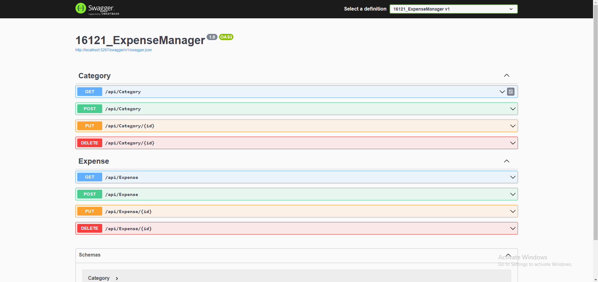
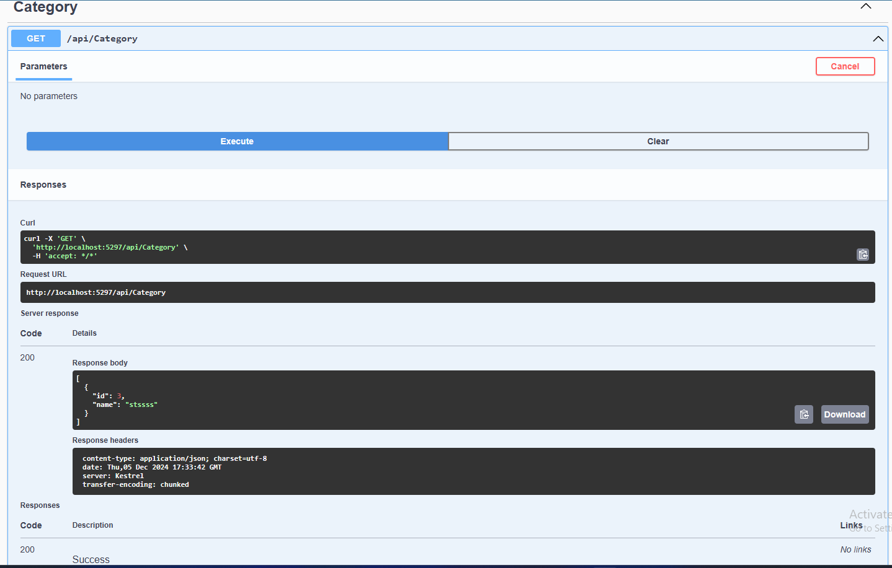
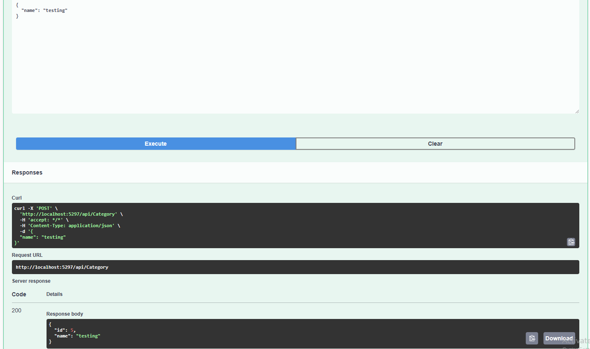
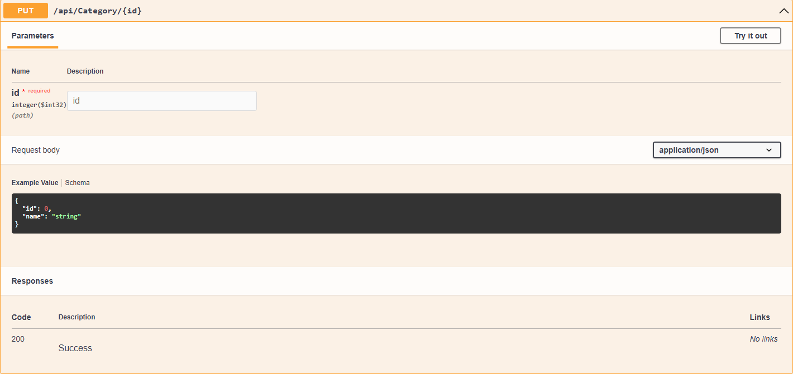
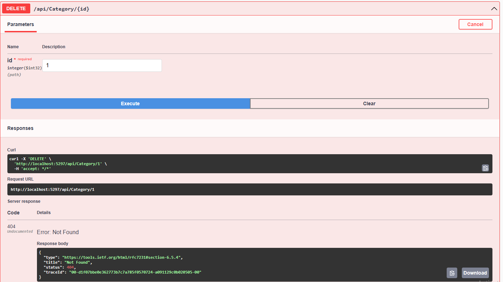

# 00016121_WAD
 This application was developed for Web Application module, as coursework portfolio project @ WIUT by student ID: 00016121
 --------------------------------------------
 16121 / 20 = ... with remainder of 1.
 
 The first topic is : EXPENSE MANAGER!
---------------------------------------------

This app (Expense Manager) is created for WAD module! The main goal of this app is to manage the expenses of the organization.

Main functionalities of the app is to: CREATE, READ, UPDATE, DELETE expenses and categories.

Technologies used: .NET 6, SQL Server Localdb, ASP.NET core, Entity Framework.

You can clone the repository using Github Desktop by getting the URL from the main page of this repository. Configure the database. If needed, you should run Migrations: dotnet ef database update
All other parts should work very well!

Unfortunately, there is no unique patterns used in the project, everything is simple without patterns

